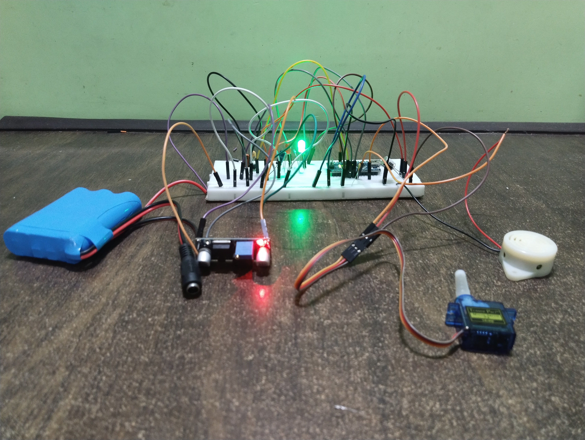
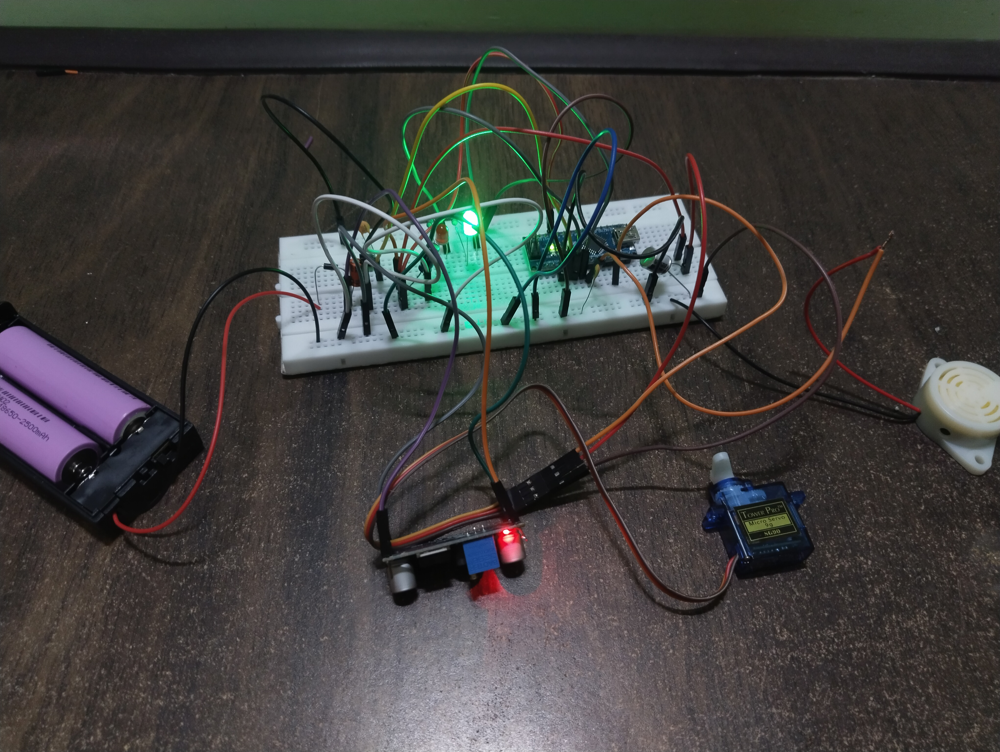
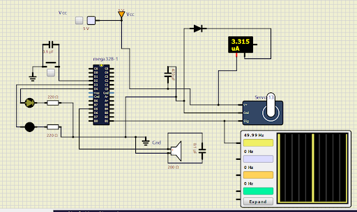

# Jinx's Flame Chomper: Animatronic Prop & Embedded Systems Study

**Status:** Ongoing (Aug 2025 – Present)  
**Tech Stack:** Arduino (C++), Power Electronics, CAD, Electromechanical Actuation

## 1. Project Overview
This project is an engineering deep-dive into replicating the "Flame Chomper" grenade from the series *Arcane*. While the aesthetic goal was a show-accurate prop, the technical objective was to master **embedded systems integration**.

The system features a **non-blocking state machine** that synchronizes mechanical actuation (Servo), audio synthesis (Piezo), and visual alerts (LEDs) to create a "chaos" mode that accelerates over time. It demonstrates practical application of PWM signaling, power distribution network (PDN) design, and interrupt-free multitasking.

## 2. System Architecture & Features
* **Microcontroller:** Arduino Nano (ATmega328P).
* **Actuation:** SG90 Servo motor driving a custom jaw mechanism.
* **Audio:** Passive Piezo modulation for variable frequency generation (rumble effects).
* **Power:** High-current discharge Li-Ion configuration (12V/7.4V) via Buck Converter regulation.
* **Logic:** Custom "Chaos Algorithm" using `millis()` for non-blocking parallel task execution.

## 3. Hardware Implementation

### Component List
* **Controller:** Arduino Nano V3
* **Power Regulation:** LM2596 DC-DC Buck Converter (Stepping down 12V/7.4V $\to$ 5.0V)
* **Actuator:** SG90 Micro Servo
* **Audio:** TDK PS110 Passive Piezo Buzzer*
* **Power Source:** 12V Lead-Acid / 2x 18650 Li-Ion (High discharge C-rating)
* **Capacitance:** 470µF Electrolytic Capacitor (Buffer)

> **Note on Prototyping (Buzzer Variant):**
> You may notice an **SFM27 Active Buzzer** in the prototype circuit photos. This was used during the "Stage 1" testing phase for basic continuity checks. The final firmware utilizes a **TDK PS110 Passive Piezo**, which is required to handle the variable frequency modulation (PWM) needed for the "rumble" and "explosion" sound effects.

### Circuit Schematics
*Below are the diagrams for the power stage configurations tested:*

**Configuration A: 12V Lab Bench/Battery Input**

**Configuration B: 7.4V Portable Li-Ion Input**

### Component Selection Rationale
*Design decisions regarding power management and protection.*

**1. Voltage Regulator: LM2596 vs. AMS1117**
* **Initial Concept:** AMS1117 (Linear Regulator).
* **Problem:** Calculations indicated significant thermal issues. Stepping down 12V to 5V with a 0.5A load creates a 7V drop, dissipating **3.5 Watts** of waste heat ($P = V_{drop} \times I$). This would trigger immediate thermal shutdown.
* **Selected Solution:** Switched to the **LM2596 Buck Converter**.
    * **Reason:** It utilizes high-frequency switching (PWM) to step down voltage efficiently (>80%), generating minimal heat compared to linear regulators.
    * **Note on Size:** While the **MP1584** was considered for its smaller footprint (due to a 1.5 MHz switching frequency allowing for smaller inductors), the **LM2596** (150 kHz) was selected based on immediate component availability and robust current handling.

**2. Flyback Diode: 1N5819 vs. 1N4007**
* **Initial Concept:** 1N4007 (Standard Silicon Rectifier).
* **Selected Solution:** **1N5819 (Schottky Diode)**.
    * **Reason 1 (Transient Response):** The servo motor generates rapid inductive voltage spikes ("noise") during operation. The 1N5819 is a fast-switching Schottky diode capable of blocking these transients instantly, whereas the 1N4007 is too slow for effective motor protection.
    * **Reason 2 (Efficiency):** The 1N5819 has a lower forward voltage drop (~0.3V) compared to the 1N4007 (~0.7V), resulting in less power loss in battery-protection applications.

---

## 4. The Engineering Journey: Problems & Solutions
*This section documents the critical failures encountered during development and the engineering principles applied to resolve them.*

### Challenge 1: The "Brownout" Vibration
**The Issue:**
During initial testing with a standard 9V battery, the servo motor would not rotate. Instead, it would vibrate violently, and the microcontroller would reset repeatedly.

**Root Cause Analysis:**
Using a multimeter, I observed a voltage collapse at the input terminals (from 9V $\to$ ~4V) whenever the servo triggered.
* **Diagnosis:** The 9V battery has high **Internal Resistance (~1.5Ω)**.
* The servo's startup current spike (~650mA) caused a massive voltage drop across the battery's internal resistance ($V_{drop} = I \times R$), starving the LM2596 regulator of necessary headroom.

**The Solution:**
I redesigned the power stage to use a **Low Internal Resistance** source.
* **Fix:** Switched to a 12V High-Discharge battery (and later 2x 18650 Li-Ion cells).
* **Result:** The stiff power rail eliminated the voltage sag, allowing the LM2596 to maintain a stable 5.0V output under load.

### Challenge 2: Inductive Noise
**The Issue:**
Even with better batteries, the Arduino would occasionally freeze during rapid servo movements.

**The Solution:**
Added a **470µF Decoupling Capacitor** across the servo power rails. This acts as a local energy reservoir, smoothing out the inductive spikes and "noise" generated by the motor coils, preventing them from feeding back into the logic circuit.

---

## 5. Software Logic (The "Chaos Engine")
The firmware avoids `delay()` to maintain responsiveness. It uses a **State Machine** architecture:

1.  **Idle State:** System waits for interrupt (Button Press). Green LED ON.
2.  **Chaos State:**
    * Calculates 3 independent timelines: **Servo**, **LED**, and **Sound**.
    * Uses `randomSeed(analogRead(0))` to generate organic, non-repeating explosion patterns.
    * **Acceleration Logic:** Every cycle, the interval between actions decreases, creating a sense of urgency.
3.  **Explosion State:** Rapid-fire random frequency generation to simulate white noise.

## 6. Project Timeline & Learning Outcomes
**Duration:** August 2025 – Present

*Why did a seemingly simple project take this long?*
This project was scoped not just as a build, but as a comprehensive learning module alongside my college semester. The timeline reflects a "First Principles" approach:
* **Phases 1-2:** Spent significant time mastering **Circuit Simulation (SimulIDE)** before touching hardware.
* **Phase 3:** Encountered the "Brownout" issue, which required pausing the build to research **Power Distribution Networks (PDN)** and Internal Resistance physics.
* **Phase 4:** Iterated on the code to move from blocking `delay()` functions to professional-grade non-blocking timers.

## 7. Media Gallery
**Simulation (SimulIDE):**  

**Prototype Demo:**
[Watch the Servo Motor Demo](https://github.com/user-attachments/assets/fb6d3c1f-4539-4eec-886c-4fc25acba1a2)

---

## Disclaimer
This project is purely experimental and educational in nature, created to explore embedded systems and interactive hardware prototyping. It is not intended for any functional application beyond demonstration.
